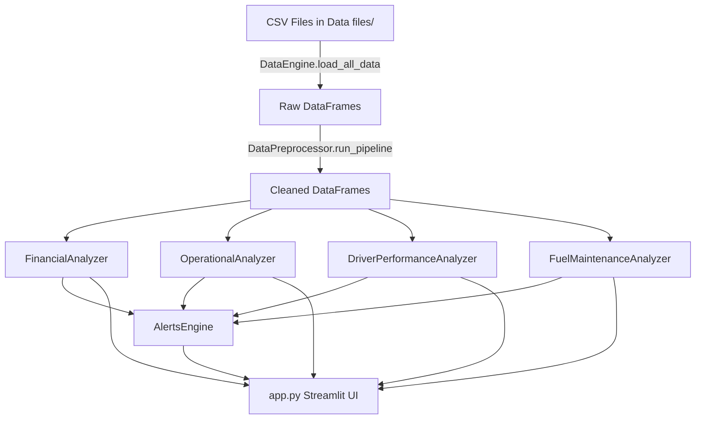

# FleetSmart Analytics - Complete Code Documentation

> **Comprehensive documentation of all Python modules, classes, functions, and methods**

---

## 📁 Project Structure Overview

| File | Lines | Purpose |
|------|-------|---------|
| `app.py` | 1016 | Streamlit web dashboard UI |
| `data_loader.py` | 39 | CSV data loading engine |
| `Data_preprocessing.py` | 81 | Data cleaning pipeline |
| `financial_analyzer.py` | 360 | Financial performance analysis |
| `Operational_Efficiency.py` | 630 | Operational/delivery efficiency |
| `driver_analyzer.py` | 471 | Driver performance analytics |
| `fuel_maintenance.py` | 426 | Fuel & maintenance cost analysis |
| `alerts_engine.py` | 204 | Centralized alert management |
| `Main_dashboard.py` | 72 | CLI menu interface |
| `Visualization.py` | 172 | Advanced chart visualizations |

---

## 1. data_loader.py

### Class: `DataEngine`

**Purpose:** Handles loading all CSV data files from the `Data files` directory into pandas DataFrames.

| Method | Parameters | Returns | Description |
|--------|------------|---------|-------------|
| `__init__` | `data_path=None` | - | Initializes data path (defaults to `../Data files`), normalizes path, creates empty `data {}` dict |
| `load_all_data` | - | `dict` | Loads 14 CSV files (drivers, trucks, trailers, customers, facilities, routes, loads, trips, fuel_purchases, maintenance_records, delivery_events, safety_incidents, driver_monthly_metrics, truck_utilization_metrics) into `self.data` dictionary |

---

## 2. Data_preprocessing.py

### Class: `DataPreprocessor`

**Purpose:** Cleans and preprocesses all loaded data tables with standardized transformations.

| Method | Parameters | Returns | Description |
|--------|------------|---------|-------------|
| `__init__` | `data_engine` | - | Stores reference to DataEngine, initializes empty `processed_data {}` |
| `run_pipeline` | - | `dict` | Iterates all loaded tables, applies `clean_table()`, stores cleaned data |
| `clean_table` | `table_name`, `df` | `DataFrame` | **Core cleaning:** (1) Normalizes column names to lowercase with underscores, (2) Fixes date columns, (3) Fills numeric nulls with mean (except IDs), (4) Drops rows with missing text data, (5) Removes duplicates, (6) Resets index |
| `_fix_dates` | `df` | `DataFrame` | Converts columns with keywords (`date`, `time`, `dt`, `timestamp`, `datetime`, `year`) to pandas datetime |

---

## 3. financial_analyzer.py

### Class: `FinancialAnalyzer`

**Purpose:** Analyzes revenue, profit, cost-per-mile, and route profitability trends.

#### Core Methods

| Method | Parameters | Returns | Description |
|--------|------------|---------|-------------|
| `__init__` | `data` | - | Stores data dict, calls `_prepare_data()` |
| `_prepare_data` | - | `DataFrame` | Merges `loads`, `trips`, `routes`; filters 2022-2024 data; calculates `profit`, `revenue_per_mile`, `cost_per_mile`, `profit_per_mile`; creates readable `route_name` |

#### Console Dashboard Methods

| Method | Parameters | Returns | Description |
|--------|------------|---------|-------------|
| `monthly_summary` | - | - | Prints monthly revenue, profit, margin % to console |
| `best_worst_routes` | - | - | Prints top 5 and worst 5 routes by margin % |
| `cost_trend` | - | - | Prints average/highest/lowest cost per mile |
| `show_dashboard` | - | - | Prints complete financial dashboard to console |

#### Streamlit Helper Methods

| Method | Parameters | Returns | Description |
|--------|------------|---------|-------------|
| `get_monthly_df` | `df=None` | `DataFrame` | Returns monthly summary with columns: Month, Revenue, Profit, Miles, Trip Count, Profit Margin %, Cost Per Mile |
| `get_route_stats_df` | `df=None`, `min_trips=5` | `DataFrame` | Returns route statistics: Route, Trip Count, Total Profit, Total Revenue, Total Miles, Margin %, Avg Revenue/Mile |
| `get_worst_routes_df` | `df=None`, `n=5` | `DataFrame` | Returns bottom N routes by margin |
| `get_cost_per_mile` | `df=None` | `float` | Calculates average cost per mile |
| `get_unique_routes` | - | `list` | Returns sorted list of unique route names for dropdowns |
| `get_date_range` | - | `tuple` | Returns (min_date, max_date) for date pickers |
| `filter_by_date` | `start_date`, `end_date` | `DataFrame` | Filters data by date range |
| `filter_by_route` | `route_names`, `df=None` | `DataFrame` | Filters data by selected routes |
| `apply_filters` | `start_date=None`, `end_date=None`, `routes=None` | `DataFrame` | Applies multiple filters at once |
| `get_kpis` | `df=None` | `dict` | Returns KPIs: total_revenue, total_profit, profit_margin, total_trips, total_miles, cost_per_mile, avg_revenue_per_trip |
| `get_alerts` | `df=None` | `list[dict]` | Returns alerts for: loss-making routes, low margin routes (<10%), overall margin below 15% |

#### Visualization Methods

| Method | Parameters | Returns | Description |
|--------|------------|---------|-------------|
| `plot_monthly_trends` | `df=None` | `Figure` | Bar chart: Monthly Revenue vs Profit |
| `plot_route_profitability` | `df=None`, `top_n=5` | `Figure` | Horizontal bar: Top N routes by margin % |
| `plot_worst_routes` | `df=None`, `n=5` | `Figure` | Horizontal bar: Bottom N routes (red for negative) |
| `plot_profit_distribution` | `df=None` | `Figure` | Histogram with KDE: profit distribution with loss zone highlighted |
| `plot_cost_trend` | `df=None` | `Figure` | Line chart: Weekly average cost per mile trend |

---

## 4. Operational_Efficiency.py

### Class: `OperationalAnalyzer`

**Purpose:** Analyzes on-time delivery, fleet utilization, driver efficiency, and operational KPIs.

#### Core Methods

| Method | Parameters | Returns | Description |
|--------|------------|---------|-------------|
| `__init__` | `data_dict` | - | Stores data, calls `_prepare_data()` |
| `_prepare_data` | - | `DataFrame` | Merges `trips`, `loads`, `delivery_events`, `routes`, `driver_monthly_metrics`, `truck_utilization_metrics`; calculates `on_time` flag (with 30-min grace); creates `route_name`; extracts month |

#### Console Dashboard Method

| Method | Parameters | Returns | Description |
|--------|------------|---------|-------------|
| `show_dashboard` | - | - | Prints: On-Time Rate, Fleet Utilization, Empty Miles %, Idle Hours, MPG, Downtime, Trips per Truck, monthly trend, worst routes, top 10 efficient drivers |

#### Streamlit Helper Methods

| Method | Parameters | Returns | Description |
|--------|------------|---------|-------------|
| `get_kpis` | `df=None` | `dict` | Returns: on_time_rate, fleet_utilization, avg_idle_hours, avg_mpg, total_trips, unique_trucks, unique_drivers |
| `get_delay_stats` | `df=None` | `dict` | Returns: avg_delay, max_delay, delayed_count, delay_pct |
| `get_route_ontime_df` | `df=None`, `min_trips=3` | `DataFrame` | Route-wise on-time rates: Route, On-Time Count, Total Trips, On-Time Rate, Delayed Count |
| `get_worst_routes_df` | `df=None`, `n=5` | `DataFrame` | Bottom N routes by on-time rate |
| `get_best_routes_df` | `df=None`, `n=5` | `DataFrame` | Top N routes by on-time rate |
| `get_truck_reliability_df` | `df=None` | `DataFrame` | Truck reliability: Truck ID, On-Time Count, Total Trips, On-Time Rate, Utilization % |
| `get_customer_ontime_df` | `df=None` | `DataFrame` | Customer-wise on-time rates with company names |
| `get_driver_reliability_df` | `df=None` | `DataFrame` | Driver ranking: Driver ID, On-Time Count, Total Trips, On-Time Rate, Avg Idle Hrs, Avg MPG, Efficiency Score, Driver Name |
| `get_utilization_df` | `df=None` | `DataFrame` | Truck utilization: Truck ID, Utilization Rate, Trip Count, Avg Downtime Hrs |
| `get_unique_values` | `column` | `list` | Returns unique values for filter dropdowns |
| `get_date_range` | - | `tuple` | Returns (min_date, max_date) for dispatch dates |
| `filter_data` | `start_date`, `end_date`, `routes`, `trucks`, `drivers`, `customers`, `on_time_status` | `DataFrame` | Applies multiple filters to operational data |
| `get_alerts` | `df=None` | `list[dict]` | Returns alerts: On-time <85% (critical), <90% (warning), low utilization, high idle, problem routes |

#### Visualization Methods

| Method | Parameters | Returns | Description |
|--------|------------|---------|-------------|
| `plot_ontime_distribution` | `df=None` | `Figure` | Pie chart: On-Time vs Delayed |
| `plot_ontime_trend` | `df=None` | `Figure` | Line chart: Monthly on-time rate with target/minimum lines and shaded areas |
| `plot_route_performance` | `df=None`, `top_n=10` | `Figure` | Horizontal bar: Route on-time rates (green/orange/red by performance) |
| `plot_truck_reliability` | `df=None`, `top_n=10` | `Figure` | Bar chart: Truck reliability rankings |
| `plot_delay_distribution` | `df=None` | `Figure` | Histogram: Delay time distribution (capped at 8 hours) |

---

## 5. driver_analyzer.py

### Class: `DriverPerformanceAnalyzer`

**Purpose:** Analyzes individual driver performance metrics, creates leaderboards, and identifies coaching opportunities.

#### Core Methods

| Method | Parameters | Returns | Description |
|--------|------------|---------|-------------|
| `__init__` | `processed_data` | - | Stores data reference |
| `_prepare_driver_data` | - | `DataFrame` | Internal helper: merges driver_monthly_metrics with driver names, adds incident counts, fixes numeric columns |

#### Console Dashboard Method

| Method | Parameters | Returns | Description |
|--------|------------|---------|-------------|
| `show_dashboard` | - | - | Prints: Fleet average metrics (revenue, MPG, idle, OTD), top 5 drivers with scores, alerts |

#### Streamlit Helper Methods

| Method | Parameters | Returns | Description |
|--------|------------|---------|-------------|
| `get_leaderboard_df` | `min_revenue=0`, `min_otd=0`, `sort_by='Score'` | `DataFrame` | Driver leaderboard: driver_id, Driver Name, Revenue, MPG, On-Time Rate, Idle Hours, Incidents, Score. **Score formula:** `(revenue/1000 * 0.5) + (MPG * 4) + (OTD * 100 * 0.4) - (idle * 3) - (incidents * 15)` |
| `get_driver_details` | `driver_id` | `dict` | Returns detailed stats: driver_id, name, total_revenue, avg_revenue, avg_mpg, avg_idle, on_time_rate, incidents, months_active |
| `search_driver` | `query` | `DataFrame` | Case-insensitive driver search by name |
| `get_unique_drivers` | - | `list` | Returns sorted list of driver names |
| `get_kpis` | - | `dict` | Fleet-wide KPIs: avg_revenue, avg_mpg, avg_idle, avg_otd, total_incidents, total_drivers |
| `get_alerts` | - | `list[dict]` | Returns alerts: OTD <85%, high idle >5hrs, incidents >8, low MPG <6.0, low performer warnings |

#### Visualization Methods

| Method | Parameters | Returns | Description |
|--------|------------|---------|-------------|
| `plot_performance_matrix` | `df=None` | `Figure` | Scatter plot: MPG vs Revenue with quadrants (Stars, High Earners, Efficient, Needs Improvement) |
| `plot_safety_heatmap` | - | `Figure` | Correlation heatmap: MPG, Idle Hours, On-Time Rate, Incidents |
| `plot_driver_comparison` | `driver_ids=None`, `top_n=10` | `Figure` | Horizontal bar: Top drivers by performance score |
| `plot_metrics_radar` | `driver_id` | `Figure` | Bar chart showing normalized metrics (Revenue, MPG, On-Time, Low Idle, Safety) for a single driver |

---

## 6. fuel_maintenance.py

### Class: `FuelMaintenanceAnalyzer`

**Purpose:** Analyzes fuel costs, maintenance expenses, and identifies high-risk trucks needing attention.

#### Core Methods

| Method | Parameters | Returns | Description |
|--------|------------|---------|-------------|
| `__init__` | `processed_data` | - | Stores data reference |

#### Console Dashboard Method

| Method | Parameters | Returns | Description |
|--------|------------|---------|-------------|
| `show_dashboard` | - | - | Prints: Fuel KPIs (total cost, gallons, price/gallon, MPG), Maintenance KPIs (cost, events, downtime), Top 5 expensive trucks, alerts |

#### Streamlit Helper Methods

| Method | Parameters | Returns | Description |
|--------|------------|---------|-------------|
| `get_kpis` | `truck_ids=None` | `dict` | Returns: total_fuel_cost, total_gallons, avg_price_gallon, fleet_mpg, total_maint_cost, maint_events, avg_downtime, total_cost |
| `get_cost_by_truck_df` | `truck_ids=None` | `DataFrame` | Per-truck costs: Truck ID, Fuel Cost, Maintenance Cost, Maint Events, Total Cost, Unit, Year |
| `get_maintenance_types_df` | `truck_ids=None` | `DataFrame` | Breakdown by type: Maintenance Type, Total Cost, Event Count, Avg Cost, Total Downtime |
| `get_fuel_trend_df` | `truck_ids=None` | `DataFrame` | Monthly trend: Month, Total Cost, Gallons, Avg Price/Gallon |
| `get_unique_trucks` | - | `list` | Returns sorted list of truck IDs |
| `filter_by_truck` | `truck_ids` | `dict` | Returns filtered data dictionaries |
| `get_high_risk_trucks` | `mileage_threshold=500000`, `age_threshold=10` | `DataFrame` | Returns trucks exceeding thresholds: Truck ID, Mileage, Age (Years), Model Year, Risk Level (Low/Medium/High) |
| `get_alerts` | `truck_ids=None` | `list[dict]` | Returns alerts: Low MPG <6.0, high downtime >8hrs, high maint cost >$50k, high-risk trucks |

#### Visualization Methods

| Method | Parameters | Returns | Description |
|--------|------------|---------|-------------|
| `plot_cost_distribution` | `truck_ids=None`, `top_n=5` | `Figure` | Stacked bar: Top N trucks showing Fuel vs Maintenance costs |
| `plot_maintenance_risk` | `truck_ids=None` | `Figure` | Scatter plot: Mileage vs Age with risk zones and threshold lines |
| `plot_fuel_trend` | `truck_ids=None` | `Figure` | Dual-axis chart: Fuel cost bars + price per gallon line |
| `plot_maintenance_types` | `truck_ids=None` | `Figure` | Pie chart: Maintenance cost by type |

---

## 7. alerts_engine.py

### Class: `AlertsEngine`

**Purpose:** Centralized alert management collecting and formatting alerts from all analyzer modules.

#### Attributes

| Attribute | Type | Description |
|-----------|------|-------------|
| `thresholds` | `dict` | Configurable thresholds: on_time_rate_critical (85), on_time_rate_warning (90), idle_hours_warning (5), fleet_mpg_warning (6.0), downtime_hours_critical (8), mileage_high (500000), truck_age_high (10), maintenance_cost_warning (50000), incident_count_critical (8), profit_margin_warning (15) |

#### Methods

| Method | Parameters | Returns | Description |
|--------|------------|---------|-------------|
| `__init__` | `data` | - | Stores data reference, initializes default thresholds |
| `set_threshold` | `key`, `value` | - | Updates a threshold value |
| `get_thresholds` | - | `dict` | Returns copy of current thresholds |
| `_get_financial_alerts` | - | `list` | Collects alerts from FinancialAnalyzer |
| `_get_operational_alerts` | - | `list` | Collects alerts from OperationalAnalyzer |
| `_get_driver_alerts` | - | `list` | Collects alerts from DriverPerformanceAnalyzer |
| `_get_fleet_alerts` | - | `list` | Collects alerts from FuelMaintenanceAnalyzer |
| `get_all_alerts` | - | `list[dict]` | Collects from all sources, adds source/timestamp, sorts by severity (critical first) |
| `get_critical_alerts` | - | `list` | Filters critical alerts |
| `get_warning_alerts` | - | `list` | Filters warning alerts |
| `get_info_alerts` | - | `list` | Filters info alerts |
| `get_alert_count` | - | `dict` | Returns: total, critical, warning, info counts |
| `get_alerts_by_source` | `source` | `list` | Filters by source module |
| `get_alerts_summary` | - | `dict` | Returns: counts, top_critical (first 3), needs_attention flag, status |
| `format_alert_for_display` | `alert` | `dict` | Adds icons and formats for Streamlit display |
| `get_formatted_alerts` | - | `list[dict]` | Returns all alerts formatted for display |

### Class: `AlertThresholdConfig`

**Purpose:** Helper class for managing alert thresholds in Settings UI.

| Method | Parameters | Returns | Description |
|--------|------------|---------|-------------|
| `get_all_configs` | (classmethod) | `dict` | Returns all threshold configurations with labels, values, and units |
| `get_config` | `key` (classmethod) | `dict` | Returns configuration for a specific threshold |

---

## 8. Visualization.py

### Class: `PredictiveInsights`

**Purpose:** Legacy class for multi-page CLI dashboard visualizations.

| Method | Parameters | Returns | Description |
|--------|------------|---------|-------------|
| `__init__` | `processed_data` | - | Stores data, sets matplotlib styles (whitegrid, 20x12 figure size) |
| `create_page` | `page_num`, `title` | `tuple` | Creates a matplotlib figure with 2x2 grid |
| `show_insights` | - | - | Legacy method, prints message to use Streamlit |

### Class: `AdvancedVisualizer`

**Purpose:** Advanced chart generation for predictive analytics and risk analysis.

| Method | Parameters | Returns | Description |
|--------|------------|---------|-------------|
| `__init__` | `data` | - | Stores data, sets seaborn darkgrid style |
| `profit_distribution` | - | `Figure` | Histogram: Profit per trip with loss zone highlighted (merges loads + trips) |
| `safety_efficiency_heatmap` | - | `Figure` | Correlation matrix: MPG, Idle Hours, On-Time Rate, Accident Count |
| `maintenance_risk_scatter` | - | `Figure` | Scatter: Odometer vs Age with risk zones, colored by model year |
| `seasonality_heatmap` | - | `Figure` | Heatmap: Load volume by Month vs Day of Week |

---

## 9. Main_dashboard.py

### Function: `main()`

**Purpose:** Entry point for command-line interface with interactive menu.

**Workflow:**
1. Displays FleetSmart banner
2. Creates `DataEngine` and `DataPreprocessor`
3. Runs data pipeline
4. Creates `FinancialAnalyzer` and `OperationalAnalyzer`
5. Displays menu loop with options:
   - `1`: Financial Performance (`finance.show_dashboard()`)
   - `2`: Operational Efficiency (`ops.show_dashboard()`)
   - `3`: Driver Performance (`DriverPerformanceAnalyzer(data).show_dashboard()`)
   - `4`: Fuel & Maintenance (`FuelMaintenanceAnalyzer(data).show_dashboard()`)
   - `5`: Predictive Insights (`PredictiveInsights(data).show_insights()`)
   - `6`: Exit

---

## 10. app.py (Streamlit Web Application)

### Configuration & Styling

| Function | Description |
|----------|-------------|
| `load_custom_css()` | Injects 150+ lines of custom CSS for professional dark theme styling |

### Data & Utilities

| Function | Parameters | Returns | Description |
|----------|------------|---------|-------------|
| `load_data()` | - | `dict` | **Cached:** Loads and preprocesses all data using DataEngine + DataPreprocessor |
| `format_currency(value)` | `value` | `str` | Formats number as `$X,XXX` |
| `format_pct(value)` | `value` | `str` | Formats number as `XX.X%` |
| `export_to_csv(df, filename)` | `df`, `filename` | - | Creates Streamlit download button for CSV |
| `export_to_excel(df, filename)` | `df`, `filename` | - | Creates Streamlit download button for Excel |
| `display_alert(alert)` | `alert` | - | Displays styled alert card in Streamlit |
| `display_kpi_row(kpis, cols_config)` | `kpis`, `cols_config` | - | Displays row of KPI metric cards |

### Main Application

| Function | Description |
|----------|-------------|
| `main()` | Main entry point: loads data, creates AlertsEngine, renders sidebar navigation, routes to page renderers |

### Page Renderers (8 Pages)

| Function | Parameters | Description |
|----------|------------|-------------|
| `render_overview_page` | `data`, `alerts_engine` | **Overview Dashboard:** Fleet KPIs, alert summary, quick stats from all modules |
| `render_financial_page` | `data` | **Financial Performance:** Date/route filters, KPIs (revenue, profit, margin), monthly trends chart, route profitability charts, cost distribution |
| `render_operational_page` | `data` | **Operational Efficiency:** Multi-filter panel (date, routes, trucks, drivers), on-time KPIs, on-time trend chart, route performance, truck reliability, delay distribution |
| `render_driver_page` | `data` | **Driver Performance:** Search/filter controls, driver leaderboard table, performance matrix scatter, safety heatmap, driver comparison chart |
| `render_fleet_costs_page` | `data` | **Fleet Costs (Fuel & Maintenance):** Truck filter, fuel/maintenance KPIs, cost distribution chart, maintenance risk scatter, fuel trend, high-risk trucks table |
| `render_predictive_page` | `data` | **Predictive Insights:** Profit distribution, safety-efficiency correlation, maintenance risk analysis, seasonality heatmap |
| `render_alerts_page` | `data`, `alerts_engine` | **Alerts Center:** Alert summary cards, filter by severity/source, full alerts list with formatted display |
| `render_settings_page` | - | **Settings:** Alert threshold configuration, data info, CSV/Excel export options |

---

## 📊 Data Flow Diagram

---

## 🔔 Alert System Architecture

| Source | Alert Types | Triggers |
|--------|-------------|----------|
| **Financial** | Loss routes, Low margin | Profit < 0, Margin < 10%, Overall margin < 15% |
| **Operations** | On-time critical/warning | OTD < 85%, OTD < 90%, Route OTD < 70% |
| **Drivers** | Performance, Safety | OTD < 85%, Idle > 5hrs, Incidents > 8, MPG < 6.0 |
| **Fleet** | Costs, Risk | MPG < 6.0, Downtime > 8hrs, Maint > $50k, High-risk trucks |

---

## 📈 Key Formulas

| Metric | Formula |
|--------|---------|
| **Profit** | `revenue - fuel_surcharge - accessorial_charges` |
| **Profit Margin %** | `(profit / revenue) * 100` |
| **Cost Per Mile** | `(fuel_surcharge + accessorial_charges) / actual_distance_miles` |
| **On-Time Flag** | `actual_datetime <= scheduled_datetime + 30 minutes` |
| **Driver Score** | `(revenue/1000 * 0.5) + (MPG * 4) + (OTD * 100 * 0.4) - (idle * 3) - (incidents * 15)` |
| **Truck Risk Level** | High = mileage > 500k AND age > 10; Medium = either; Low = neither |

---

*Generated: 2026-01-07 | FleetSmart Analytics Documentation*
